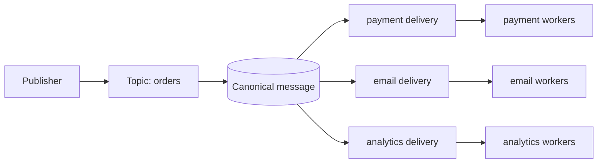

<p align="center">
  
</p>

<h1 align="center">BlockQueue</h1>

<p align="center">
  A durable, embeddable fan-out queue for Go, backed by SQLite or PostgreSQL.
</p>

<p align="center">
  <a href="https://pkg.go.dev/github.com/yudhasubki/blockqueue"></a>
  <a href="https://github.com/yudhasubki/blockqueue/actions/workflows/ci.yaml"></a>
  
  <a href="LICENSE"></a>
</p>

BlockQueue stores one canonical message and creates one independently leased
delivery for every subscriber. Use it as an imported Go package or run the
optional HTTP service for cross-language clients.



Why BlockQueue:

- **SQLite first:** embed a durable queue without operating another service.
- **PostgreSQL scale-out:** coordinate claims and schedules across processes.
- **Real fan-out:** every subscriber owns independent retry and completion
  state.
- **Transactional APIs:** commit application rows with publish or completion.
- **HTTP included:** expose the same queue model to non-Go applications.

Turso/libSQL support is experimental. Delivery is at least once; handlers must
be idempotent unless their database side effect and completion share one
transaction.

## Install

```bash
go get github.com/yudhasubki/blockqueue
```

The standalone server is optional:

```bash
go build -o blockqueue ./cmd/blockqueue
```

## Quick start

This complete example creates one topic, publishes durably, claims the
subscriber delivery, and ACKs the exact lease that was returned:

```go
package main

import (
	"context"
	"log"
	"time"

	"github.com/yudhasubki/blockqueue"
	"github.com/yudhasubki/blockqueue/store/sqlite"
)

func main() {
	ctx := context.Background()
	driver, err := sqlite.Open("queue.db", sqlite.Config{})
	if err != nil {
		log.Fatal(err)
	}

	queue := blockqueue.New(driver, blockqueue.Options{})
	if err := queue.Run(ctx); err != nil {
		log.Fatal(err)
	}
	defer queue.Close()

	topic := blockqueue.NewTopic("orders")
	subscriber := blockqueue.NewSubscriber(topic, "fulfillment", blockqueue.SubscriberOptions{
		MaxAttempts:        5,
		VisibilityDuration: "30s",
	})
	if err := queue.CreateTopic(ctx, topic, blockqueue.Subscribers{subscriber}); err != nil {
		log.Fatal(err)
	}

	receipt, err := queue.Publish(ctx, topic, blockqueue.Message{
		Message:        `{"order_id":"1022"}`,
		IdempotencyKey: "order-1022",
	})
	if err != nil {
		log.Fatal(err)
	}
	log.Printf("persisted %s", receipt.MessageID)

	deliveries, err := queue.ClaimWait(ctx, topic, subscriber.Name, 10, time.Minute)
	if err != nil {
		log.Fatal(err)
	}
	for _, delivery := range deliveries {
		log.Printf("processing %s", delivery.Message)
		if err := queue.AckDelivery(
			ctx, topic, subscriber.Name, delivery.ID, delivery.ReceiptToken,
		); err != nil {
			log.Fatal(err)
		}
	}
}
```

`Publish` waits for the canonical message and complete subscriber fan-out to
commit. Use `PublishAsync` only when process-local admission is sufficient.

## Managed Go workers

The `worker` package handles claim loops, bounded concurrency, heartbeats,
panic recovery, retry, batched completion, and graceful drain:

```go
type FulfillOrder struct {
	OrderID string `json:"order_id"`
}

runner, err := worker.NewJSON(
	queue,
	topic,
	subscriber.Name,
	worker.TypedHandlerFunc[FulfillOrder](func(
		ctx context.Context,
		job *worker.TypedJob[FulfillOrder],
	) error {
		return fulfill(ctx, job.Args.OrderID)
	}),
	worker.Options{Concurrency: 16},
)
if err != nil {
	log.Fatal(err)
}

if err := runner.Run(ctx); err != nil {
	log.Fatal(err)
}
```

Run several topic/subscriber workers under one lifecycle with `worker.Group`:

```go
group, err := worker.NewGroup(paymentWorker, emailWorker, analyticsWorker)
if err != nil {
	log.Fatal(err)
}

if err := group.Run(ctx); err != nil {
	log.Fatal(err)
}
```

Each worker keeps its own concurrency limit. A terminal error from one worker
cancels and drains its peers; cancelling `ctx` gracefully drains the whole
group. For the same subscriber, prefer one worker with higher `Concurrency`.

Returning `nil` ACKs the job. Returning an error NACKs it using the subscriber
retry policy. Use `worker.RetryAfter` for one custom delay and
`worker.CancelJob` for a permanent outcome. See the runnable
[worker example](example/worker).

## Transactional completion

When application tables and BlockQueue share the same database,
`Job.CompleteTx` commits the business update and ACK together:

```go
return job.CompleteTx(ctx, nil, func(tx *sql.Tx) error {
	_, err := tx.ExecContext(ctx,
		"UPDATE orders SET fulfilled_at = ? WHERE id = ?",
		time.Now().UTC(), job.Args.OrderID,
	)
	return err
})
```

If that transaction rolls back, both the update and ACK roll back. Producer
`PublishTx` provides the same atomic boundary for inserting application data
and publishing later work. The consumer still runs in a separate transaction
after publish commits.

See [Concepts](docs/concepts.md#transactions) and the runnable
[transactional example](example/transactional). Remote HTTP requests cannot
join a caller's database transaction; use the documented
[outbox pattern](docs/http-outbox.md).

## HTTP service

Copy [config.yaml.example](config.yaml.example), then start the server:

```bash
./blockqueue migrate -config config.yaml
./blockqueue http -config config.yaml
```

Create a topic and publish durably:

```bash
curl -X POST http://127.0.0.1:8080/v1/topics \
  -H 'Content-Type: application/json' \
  -d '{
    "name":"orders",
    "subscribers":[{
      "name":"fulfillment",
      "option":{"max_attempts":5,"visibility_duration":"30s"}
    }]
  }'

curl -X POST \
  'http://127.0.0.1:8080/v1/topics/orders/messages?wait_for=commit' \
  -H 'Content-Type: application/json' \
  -d '{"message":"order-1022","idempotency_key":"order-1022"}'
```

HTTP publish is async by default and returns `202`. Add `?wait_for=commit` when
the response must imply a committed message and fan-out. The OpenAPI 3.1
contract is served at `/openapi.json`; errors use `application/problem+json`.

The binary binds to `127.0.0.1` by default. Public deployments need an
authenticated reverse proxy or private network.

## Capabilities

| Area | Included |
| --- | --- |
| Publish | Durable/async batch publish, idempotency, priority, headers, delay, absolute scheduling |
| Delivery | Receipt leases, ACK, NACK, heartbeat, snooze, cancellation, DLQ and replay |
| Scheduler | Five-field cron, IANA timezone, misfire recovery, overlap policy, run history |
| Transactions | Publish and delivery completion with application rows in the same database |
| Operations | `/livez`, `/readyz`, dashboard, Prometheus metrics, bounded retention and maintenance |
| API | Importable Go packages and an HTTP `/v1` contract with cursor pagination |

## Storage

| Backend | Status | Coordination | Strict default |
| --- | --- | --- | --- |
| SQLite | Supported | Embedded, single coordinated writer | WAL + `synchronous=FULL` |
| PostgreSQL | Supported | Multi-process claims and scheduler leases | TLS + `synchronous_commit=on` |
| Turso/libSQL | Experimental | Smoke-test scope | Backend dependent |

The database is authoritative. In-memory wakeups and PostgreSQL notifications
only reduce latency. `store.DurabilityBalanced` is an explicit performance
tradeoff and can lose the newest acknowledged writes after power loss or
failover.

## Documentation

| Read | When you need |
| --- | --- |
| [Concepts](docs/concepts.md) | Topic fan-out, delivery leases, transactions, topology, worker groups, and maintenance |
| [Architecture](docs/architecture.md) | Packages, locking, persistence, and multi-node algorithms |
| [HTTP outbox](docs/http-outbox.md) | Atomic business writes for remote HTTP publishers |
| [Benchmarks](benchmark/README.md) | Reproducible SQLite/PostgreSQL performance and acceptance runs |
| [Changelog](CHANGELOG.md) | Release features, fixes, and explicitly documented breaking changes |

There is one queue engine and one current HTTP contract at `/v1`. BlockQueue is
pre-1.0; minor releases can contain explicitly documented breaking changes.
The root package, `worker`, `httpapi`, `store/sqlite`, and `store/postgres` are
supported APIs. `store/turso` remains experimental.

## Development

```bash
go test ./...
go test -race ./...
go vet ./...
```

CI runs the shared SQLite/PostgreSQL contract suite, race detector, lint,
staticcheck, vulnerability checks, and guarded benchmark smoke tests.

Report vulnerabilities through [private vulnerability reporting](SECURITY.md).
BlockQueue is licensed under the [Apache License 2.0](LICENSE).
