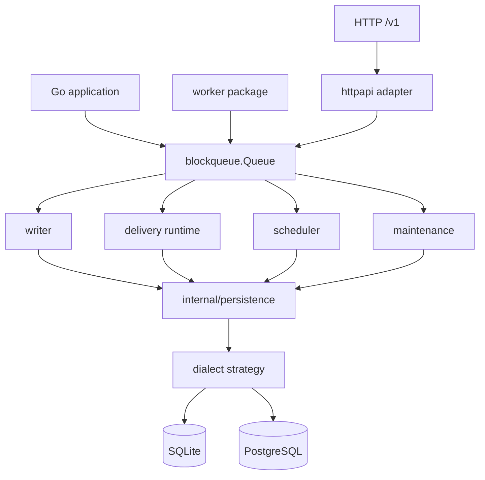
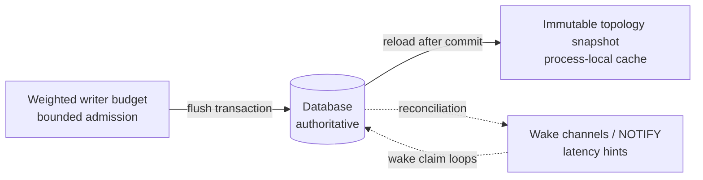
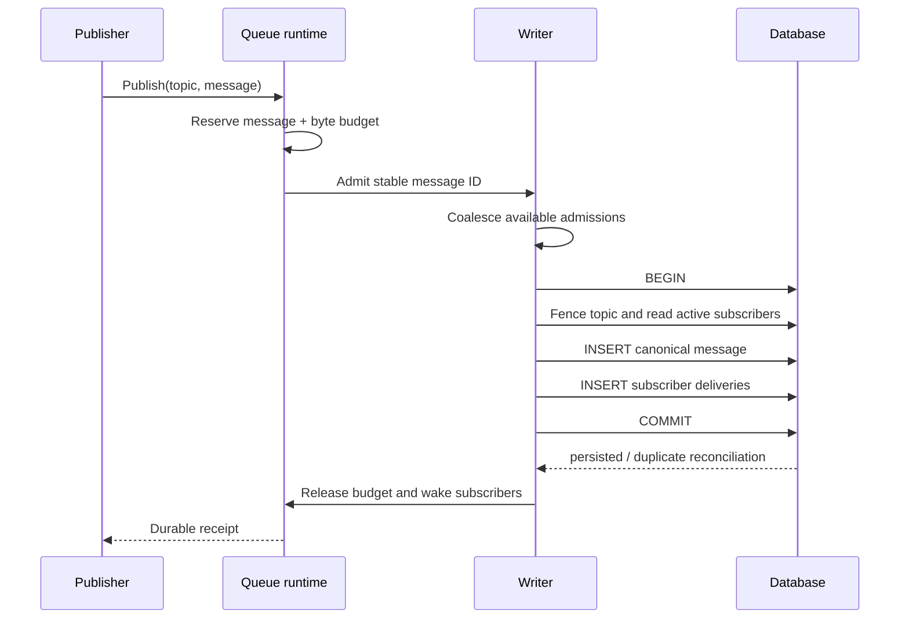
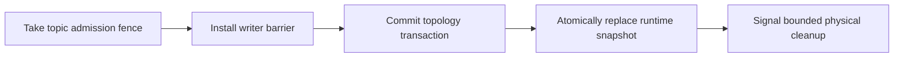
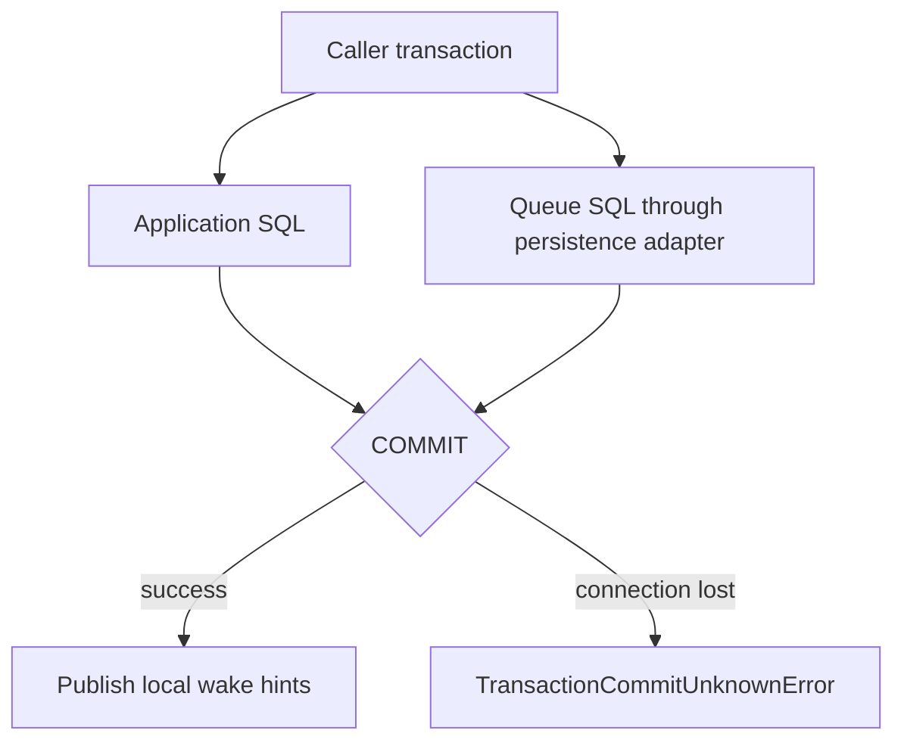
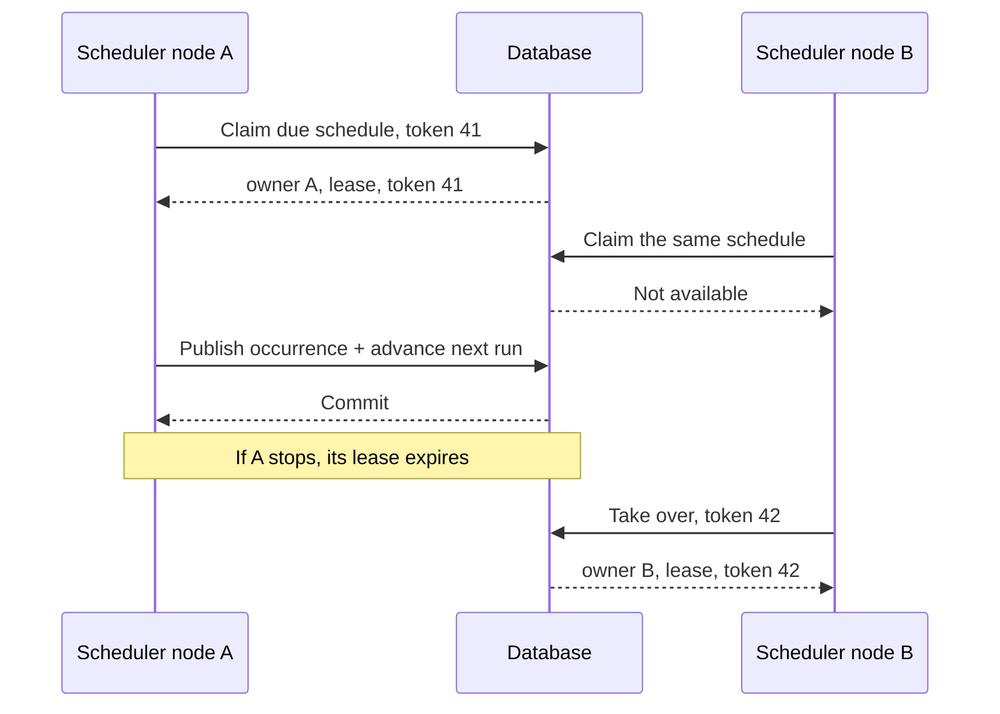
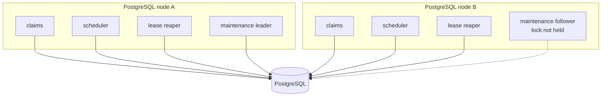

# Architecture

This document describes ownership, transaction boundaries, locking, and
multi-node coordination. Start with [Concepts](concepts.md) for the
user-facing model.

BlockQueue has one engine, one canonical schema, and one HTTP contract at
`/v1`. The optional worker and HTTP layers call the same queue primitives.



## Package ownership

```text
blockqueue/
  public models, lifecycle, admission, delivery, scheduling

worker/
  optional handler runtime; owns no durable state

httpapi/
  transport validation and status mapping

store/
  public connection-driver contract and backend configuration

internal/persistence/
  all queue SQL, migrations, row models, dialect behavior, statement cache
```

Public callers never import persistence models. Queue orchestration contains
no embedded delivery or topology SQL. Backend selection happens once during
construction; hot paths call one unexported dialect strategy instead of
scattering driver-name conditionals.

The root package uses one concrete persistence adapter rather than exposing a
broad repository interface. `store.Driver` remains intentionally small so an
embedder can provide a database connection without replacing queue semantics.

## State ownership



Only the database owns durable messages, delivery ownership, schedule leases,
and terminal outcomes. Memory owns:

- immutable routing snapshots;
- admitted writes bounded by message count and bytes;
- health state; and
- wake-up hints.

A lost PostgreSQL notification or process restart cannot lose durable work;
bounded database polling remains authoritative.

## Publish and topology fencing

Publish must commit one message and its complete subscriber fan-out against a
stable topology. Destructive topology changes must not race through an older
runtime snapshot.



PostgreSQL publish uses `FOR SHARE` on affected topic rows, allowing publishers
to proceed concurrently. Topic/subscriber deletion uses `FOR UPDATE`, so it
waits for older publishers before changing active topology. Multi-topic batches
lock topic UUIDs in sorted order.

SQLite obtains the same serialization through its immediate writer
transaction.

A destructive mutation follows this order:



If the database transaction fails, the runtime snapshot is unchanged. Logical
deletion is the API completion point; physical data removal is maintenance.

## Writer durability

The writer reserves both pending-message count and estimated bytes. A
reservation is released only after commit or a definitive permanent failure.
Reading an admission from the channel does not release capacity.

```text
transient database error
  retain the exact batch -> jittered exponential backoff -> retry

permanent admission error
  isolate the admission -> complete its waiter with an error -> continue

ambiguous commit
  retry stable IDs -> ON CONFLICT reconciliation -> never duplicate fan-out
```

Durable caller cancellation after admission does not cancel writer ownership.
It returns `CommitUnknownError` with stable IDs while persistence continues.
Immediate and delayed timestamps come from database time inside the write
transaction.

## Delivery ownership

Claim correctness is database-based; there is no process-global claim mutex.

| Operation | SQLite | PostgreSQL |
| --- | --- | --- |
| Claim candidates | Immediate writer transaction | `FOR UPDATE SKIP LOCKED` |
| Lease time | Database clock | Database clock |
| Completion | Receipt-fenced update | Receipt-fenced update |
| Batch ACK/NACK | Set-based transaction | Set-based transaction |

Every claim writes a new receipt and lease expiry. ACK, NACK, heartbeat,
snooze, and worker cancellation compare the current receipt in the transition
statement. A stale worker therefore cannot complete a newer attempt.

Terminal delivery transitions update only related schedule runs. The delivery
hot path never performs a global schedule-run sweep.

See [Delivery states](concepts.md#delivery-states) for the public state model.

## Caller-owned transactions

`PublishTx`, delivery-side `*Tx` methods, and `Job.CompleteTx` execute through
the caller's `database/sql` transaction. `Queue.WithTx` is preferred because it
registers in-flight work, owns commit/rollback, and emits local wake hints only
after commit.



`WithTx` never retries the application callback. A commit connection error can
mean that both application and queue rows already committed, so callers must
reconcile rather than rerun non-idempotent logic.

PostgreSQL holds a shared topic fence during transactional publish. SQLite has
one writer, so an open caller transaction serializes writer flushes, claims,
and completions until it ends. Keep callbacks short and free of remote I/O.

## Scheduler coordination

Schedule ownership is defined by owner ID, lease expiry, and an increasing
fencing token. Claiming an occurrence, creating its run, publishing canonical
message/fan-out rows, and advancing `next_run_at` share one transaction.



Occurrence idempotency is derived from schedule ID and scheduled time. Restart
recovery creates at most one missed occurrence before moving `next_run_at` into
the future.

## Bounded maintenance and multi-node work



Claims, schedulers, and lease reapers remain distributed because row locks,
leases, receipts, and fencing tokens establish ownership. One session advisory
lock leader performs global retention and physical topology cleanup so N nodes
do not repeat the same scans.

Large maintenance work is chunked:

- reaper: at most eight 1,000-row chunks per pass;
- scheduler: at most 100 due occurrences per pass;
- topology cleanup: independently committed 1,000-row dependency batches; and
- retention: bounded by batch size and a per-pass time budget.

A saturated pass yields before continuing, preserving SQLite writer access and
short PostgreSQL transactions. SQLite additionally performs adaptive WAL
checkpointing and incremental vacuum.

## Migrations

Migrations are embedded, ordered, transactional, and recorded with SHA-256
checksums. An applied file whose checksum changes causes startup to fail.

PostgreSQL serializes migrators with a transaction-scoped advisory lock.
SQLite begins an immediate transaction before reading or updating the migration
ledger. `Queue.Run` completes migrations and loads the entire runtime snapshot
before starting background processes.

## Lifecycle and shutdown

```mermaid
flowchart LR
    NEW["new"] -->|"Run"| START["migrate + validate + load topology"]
    START --> RUN["running"]
    RUN -->|"Shutdown"| STOPPING["stopping"]
    STOPPING --> ADMISSION["stop admission"]
    ADMISSION --> TX["drain control operations and WithTx"]
    TX --> WRITER["flush or abort writer at deadline"]
    WRITER --> BG["stop listener, scheduler, reaper, pruner, checkpointer"]
    BG --> CP["final SQLite TRUNCATE checkpoint"]
    CP --> CLOSE["close database"]
    CLOSE --> STOPPED["stopped"]
```



Startup publishes no partially initialized runtime. Shutdown with undrained
admissions returns an error rather than silently dropping ownership.

Workers have a separate lifecycle. Canceling a worker stops new claims, keeps
heartbeats active during its drain window, then cancels handler contexts.
Applications stop workers before shutting down `Queue`, ensuring compliant
handlers retain database access through completion.

The optional HTTP binary first stops network admission and drains in-flight
requests before invoking queue shutdown. Embedded applications own the same
ordering around their HTTP server.
