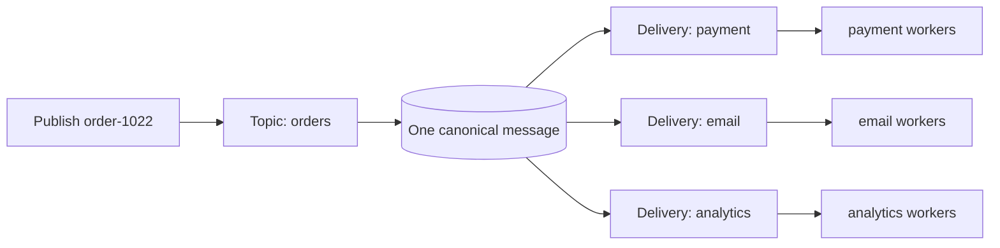
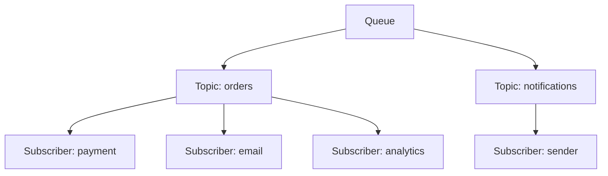
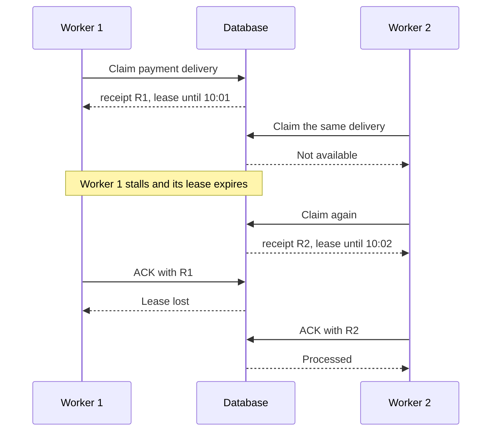
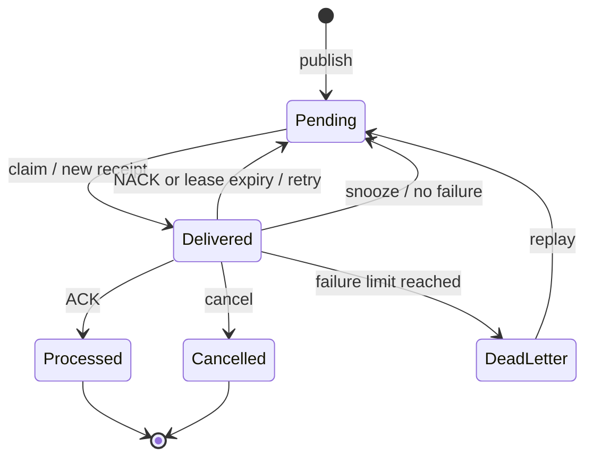
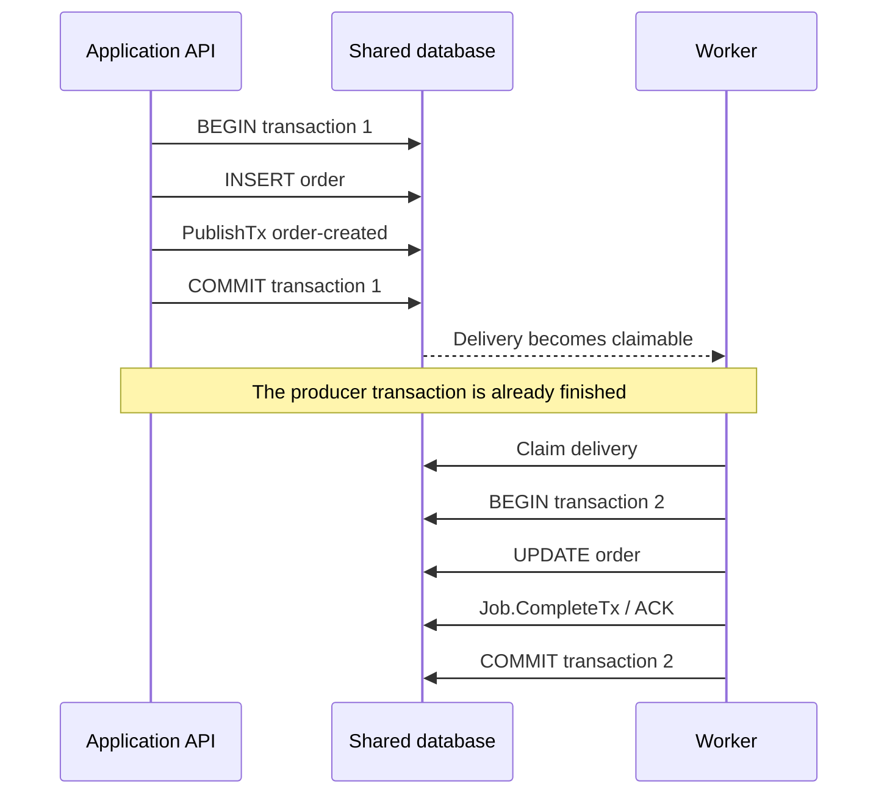
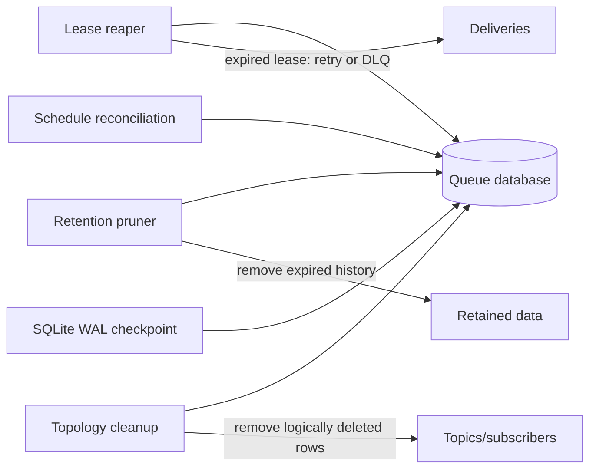
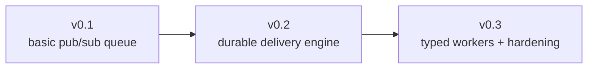

# BlockQueue concepts

BlockQueue is an at-least-once fan-out queue. It stores one message, creates
one delivery per subscriber, and lets multiple workers compete safely for each
subscriber's work.

This is the product model. Implementation details such as lock order and query
strategy live in [Architecture](architecture.md).

## Start with one order



`payment`, `email`, and `analytics` each own an independent delivery. Payment
can retry while email has already ACKed. Ten payment worker processes still
share the one payment delivery; they do not create ten copies.

The corresponding setup is small:

```go
topic := blockqueue.NewTopic("orders")

payment := blockqueue.NewSubscriber(topic, "payment", blockqueue.SubscriberOptions{
	MaxAttempts:        5,
	VisibilityDuration: "1m",
})
email := blockqueue.NewSubscriber(topic, "email", blockqueue.SubscriberOptions{
	MaxAttempts:        3,
	VisibilityDuration: "30s",
})

err := queue.CreateTopic(
	ctx,
	topic,
	blockqueue.Subscribers{payment, email},
)
```

Publishing creates one canonical message plus the two delivery rows in one
transaction:

```go
receipt, err := queue.Publish(ctx, topic, blockqueue.Message{
	Message:        `{"order_id":"1022"}`,
	Headers:        map[string]string{"source": "checkout"},
	CorrelationID:  "checkout-8842",
	IdempotencyKey: "order-1022-created",
	Priority:       10,
})
```

## Topology is routing configuration

Topology is the topic/subscriber tree, not a message and not a worker:



Creating, deleting, pausing, or resuming those resources changes topology.
Publishing and claiming are data operations that use it.

```go
err := queue.PauseSubscriber(ctx, topic, "email")
err = queue.ResumeSubscriber(ctx, topic, "email")

newSubscriber := blockqueue.NewSubscriber(
	topic,
	"warehouse",
	blockqueue.SubscriberOptions{},
)
err = queue.CreateSubscribers(
	ctx,
	topic,
	blockqueue.Subscribers{newSubscriber},
)
```

A paused subscriber keeps receiving persisted fan-out but cannot claim it
until resumed. A subscriber added later receives future messages only; old
messages are not backfilled.

Topology changes are fenced against publishing. If deletion and publish race,
the database establishes one order: either publish creates that subscriber's
delivery first, or deletion removes it from future fan-out first. The in-memory
routing snapshot changes only after the database commit succeeds.

Deletion becomes visible immediately. Physical rows are reclaimed later by
bounded maintenance, avoiding one large database transaction.

## Message, delivery, and job are different views

```text
Message
  durable payload and stable message ID

Delivery
  one subscriber's status, lease, retries, and outcome for that message

Job
  the worker package's in-memory wrapper around one claimed delivery
```

`Job` is not another table and not another queue engine. The low-level API
returns `Delivery`; the managed worker passes the same claimed data to a
handler as `Job` or `TypedJob[T]`.

## Claiming creates temporary ownership



A lease is not a database lock held while application code runs. Claim commits
first and returns a receipt token. ACK, NACK, heartbeat, snooze, and worker
cancellation are accepted only for the current receipt.

## Delivery states



`delivery_count` increases on every claim. `failure_count` increases only on
NACK or lease expiry and decides when the delivery enters DLQ. Snooze delays
work without consuming the failure budget. Failure text remains available in
paginated delivery error history.

The subscriber owns retry policy:

```go
subscriber := blockqueue.NewSubscriber(topic, "payment", blockqueue.SubscriberOptions{
	MaxAttempts:        5,
	VisibilityDuration: "1m",
	RetryPolicy: blockqueue.RetryPolicy{
		InitialDelay: "1s",
		MaxDelay:     "5m",
		Multiplier:   2,
		Jitter:       0.2,
	},
})
```

## Durable, async, and scheduled publish

```go
// Waits for message + complete fan-out to commit.
durable, err := queue.Publish(ctx, topic, message)

// Returns after bounded process-local admission.
async, err := queue.PublishAsync(ctx, topic, message)

// One message visible in five minutes.
delayed, err := queue.Publish(ctx, topic, blockqueue.Message{
	Message: "send reminder",
	Delay:   "5m",
})

// One message visible at an absolute timestamp.
scheduled, err := queue.Publish(ctx, topic, blockqueue.Message{
	Message:    "close billing period",
	ScheduleAt: "2026-08-01T00:00:00+09:00",
})
```

Durable success means the database committed the message and all delivery rows.
Async success means the bounded writer accepted responsibility inside the
current process; there is no separate local disk spool.

If a database commits but the connection drops before returning success, the
result is ambiguous. BlockQueue retries using the same stable message identity
and reconciles the committed row without creating duplicate fan-out.

Recurring work is a durable schedule rather than a delayed message:

```go
schedule, err := queue.CreateSchedule(ctx, topic, blockqueue.ScheduleInput{
	Name:           "daily-summary",
	CronExpression: "0 9 * * *",
	Timezone:       "Asia/Tokyo",
	Message:        `{"type":"daily_summary"}`,
})
```

Each occurrence has deterministic identity and run history. Scheduler
ownership is leased and fenced so another process can take over after failure.
Default recovery fires at most one missed occurrence; default overlap skips a
new run until the preceding run's deliveries are terminal.

## Transactions

Transactions do not run the consumer inside publish. The producer and consumer
are separated in time:



Producer transaction:

```go
err := queue.WithTx(ctx, nil, func(tx *sql.Tx) error {
	if err := insertOrder(ctx, tx, order); err != nil {
		return err
	}
	_, err := queue.PublishTx(ctx, tx, topic, blockqueue.Message{
		Message:        order.Payload(),
		IdempotencyKey: "fulfill-" + order.ID,
	})
	return err
})
```

Consumer transaction:

```go
return job.CompleteTx(ctx, nil, func(tx *sql.Tx) error {
	return markOrderFulfilled(ctx, tx, job.Args.OrderID)
})
```

If transaction 1 rolls back, neither order nor message exists. Once it commits,
a later consumer failure cannot roll the order creation back. Transaction 2
instead makes the consumer's business update and ACK atomic: both commit or
both retry.

These APIs require application and queue tables in the same database. An HTTP
client cannot join a remote transaction; use the
[transactional outbox](http-outbox.md).

## Worker automates the delivery loop

Without `worker`, application code owns this loop:

```text
claim -> handle -> heartbeat -> ACK/NACK -> repeat -> drain on shutdown
```

The worker package supplies bounded concurrency, typed decoding, heartbeat,
panic recovery, retry, batched completion, and graceful drain:

```go
runner, err := worker.NewJSON(
	queue,
	topic,
	"payment",
	worker.TypedHandlerFunc[ChargePayment](func(
		ctx context.Context,
		job *worker.TypedJob[ChargePayment],
	) error {
		if job.Args.Amount <= 0 {
			return worker.CancelJob(errors.New("invalid amount"))
		}
		return charge(ctx, job.Args)
	}),
	worker.Options{Concurrency: 32},
)

err = runner.Run(ctx)
```

Several independent topic/subscriber workers can share one lifecycle:

```go
group, err := worker.NewGroup(paymentWorker, emailWorker, analyticsWorker)
if err != nil {
	return err
}
return group.Run(ctx)
```

Concurrency remains bounded per worker; the group does not impose a global
limit. Use one worker with a larger `Concurrency` when parallelism is only for
one subscriber.

Returning `nil` ACKs automatically. A normal error NACKs. `RetryAfter` changes
one retry delay, and `CancelJob` records a permanent terminal result.

Workers do not create exactly-once external side effects. Keep handlers
idempotent or use `CompleteTx` when the side effect shares the queue database.

## Maintenance keeps storage healthy



Maintenance is internal housekeeping, not application job execution. Work is
chunked and time-bounded so it cannot monopolize SQLite's writer or one large
PostgreSQL transaction.

PostgreSQL elects one leader for global retention and topology cleanup.
Delivery claims and scheduler ownership remain distributed. PostgreSQL
notifications and local listener channels are only wake-up hints; database
reconciliation remains authoritative.

## Choose a storage and API layer

```text
SQLite
  embedded, single process, WAL, one coordinated writer

PostgreSQL
  multiple processes, SKIP LOCKED claims, leased scheduler ownership

Turso/libSQL
  experimental smoke-test support
```

```text
blockqueue package
  low-level publish, claim, completion, schedule, and transaction API

worker package
  managed Go handler execution over the same delivery API

HTTP /v1
  remote access to the same queue model; no shared caller transaction
```

The standalone binary is optional. Importing BlockQueue does not start an HTTP
server.

## What is public and what is internal?

Application code normally uses:

```text
Queue -> Topic -> Subscriber -> Publish -> Worker/Claim -> Complete
```

The engine manages:

```text
writer budget, topology snapshot, receipt generation, listener,
statement cache, lease reaper, retention, checkpoint, and maintenance leader
```

Those internal mechanisms are reliability implementation, not extra concepts
that every application must configure.

## Releases and guarantees



v0.2 intentionally replaced the v0.1 schema with canonical messages,
subscriber deliveries, receipt leases, transactions, delivery controls, and
scheduling. v0.3 builds on that engine with managed workers and production
hardening; it does not introduce a third queue model.

The HTTP contract remains `/v1`. Migration numbers such as `0001` and `0002`
are database migration order, not product or HTTP versions.

BlockQueue guarantees at-least-once delivery, transactional fan-out,
receipt-fenced ownership, stable publish reconciliation, and durable schedule
recovery. It does not provide exactly-once arbitrary side effects, built-in
authentication, multi-tenancy, workflow/DAG orchestration, or a disk spool for
async admission.

Continue with:

- [README](../README.md) for installation and quick starts.
- [Architecture](architecture.md) for locking and storage algorithms.
- [Worker example](../example/worker) for a runnable typed consumer.
- [Transactional example](../example/transactional) for atomic application
  writes and queue completion.
