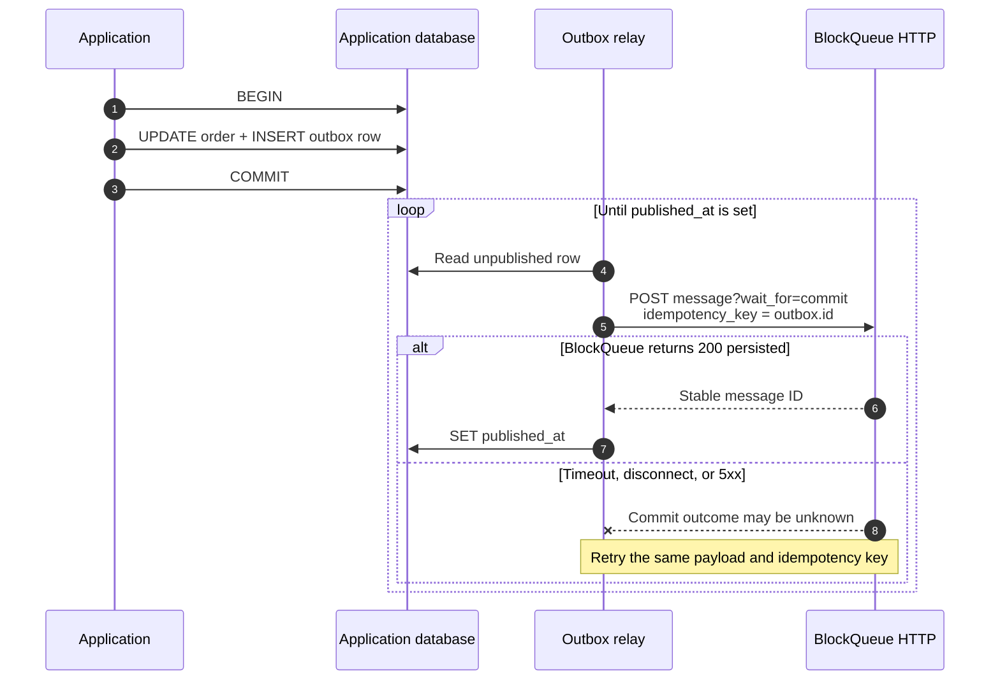

# Transactional outbox for HTTP

An HTTP request cannot join the database transaction of another process. Do
not update business data, commit, and then hope a separate HTTP publish works.
Store an outbox row beside the business update and let a relay publish it.

> `application_outbox` belongs to the application and lives in its business
> database. BlockQueue does not create, migrate, or read this table. The schema
> below is a starting point that the application may adapt.



The two important atomic boundaries are visible in the diagram:

```text
business change + outbox INSERT    commit together
BlockQueue message + fan-out       commit together
```

The relay connects those transactions with a stable idempotency key.

## 1. Create the outbox

```sql
CREATE TABLE application_outbox (
    id              VARCHAR(128) PRIMARY KEY,
    topic           VARCHAR(150) NOT NULL,
    message         TEXT NOT NULL,
    headers         TEXT NOT NULL DEFAULT '{}',
    created_at      TIMESTAMP NOT NULL DEFAULT CURRENT_TIMESTAMP,
    published_at    TIMESTAMP NULL,
    last_error      TEXT NULL
);
```

The ID must be globally unique and must never be reused.

## 2. Write business state and the event together

```sql
BEGIN;

UPDATE orders
SET status = 'paid'
WHERE id = :order_id;

INSERT INTO application_outbox (id, topic, message)
VALUES (:event_id, 'orders.paid', :json_payload);

COMMIT;
```

If this transaction rolls back, neither the paid state nor the event exists.

## 3. Relay with durable publish

Use the outbox ID as BlockQueue's `idempotency_key`:

```http
POST /v1/topics/orders.paid/messages?wait_for=commit
Content-Type: application/json

{
  "message": "{\"order_id\":\"order-42\"}",
  "idempotency_key": "order-paid-018f..."
}
```

Mark the outbox row published only after HTTP `200`:

```sql
UPDATE application_outbox
SET published_at = CURRENT_TIMESTAMP,
    last_error = NULL
WHERE id = :event_id;
```

Do not mark it published after async `202`; that response means process-local
admission, not a committed message.

## Failure behavior

```text
HTTP 200
  mark published

timeout / disconnect / 5xx
  keep row and retry the same ID

permanent 4xx
  keep row, record the error, alert an operator

relay crashes after BlockQueue commit
  retry the same ID; BlockQueue returns the same canonical message
```

A duplicate result after retry is success: it confirms that the same message
was already committed without creating another subscriber fan-out.

Keep relay transactions short. PostgreSQL relays can claim bounded batches
with `FOR UPDATE SKIP LOCKED`; SQLite relays should use one short writer
transaction. Never hold the application transaction open during the HTTP call.

Monitor oldest unpublished age, retry count, and permanent errors. Retain
outbox rows longer than the maximum relay retry window. BlockQueue idempotency
lasts while the canonical message remains retained, so old outbox IDs must not
be recycled.
